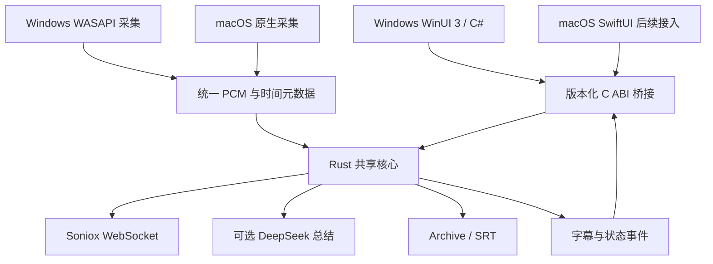

# 02 架构与技术决策

> v3：下文 Rust 推荐与桥接方案保留作候选，已不作为首发前置条件。当前采取现有 Swift/SwiftUI Mac 渐进完善、WinUI/C# Windows 原生实现，共用契约与样本；以 [07](07-Mac优先的桌面实施方案.md) 为准。

> v2：本文保留桌面实现细节。四端技术比较与 Android/iOS 桥接、生命周期以 [05](05-四端产品与架构.md) 为准，不能直接把桌面睡眠恢复规则搬到手机。

## 1. 方案比较

下表为工程判断，不是性能实测。

| 方向 | Windows 原生体验 | 与现有 SwiftUI Mac 共用核心 | 主要成本 | 结论 |
|---|---|---|---|---|
| WinUI 3 + C# 全栈 | 强 | 需要额外桥接或另一份逻辑 | Windows 首版较直接，双平台业务容易分叉 | 若只做 Windows 可选 |
| Avalonia + .NET | 可形成一致桌面体验，控件并非 WinUI | 通常需要重写 Mac UI | 一个 UI 工程，牺牲部分平台原生习惯 | 适合统一 UI 优先 |
| Tauri + Web UI + Rust | 系统窗口原生，内容是 Web UI | Rust 可共用 | Web UI、原生采集和桥接三层 | 适合 Web 技能优先 |
| **WinUI 3 / SwiftUI + Rust** | **两端各用原生 UI** | **同一业务核心** | **两套 UI、外部函数接口和多平台构建** | **最符合三个目标，推荐** |

Microsoft 将 WinUI 3/Windows App SDK 用于原生桌面开发：[官方入口](https://learn.microsoft.com/en-us/windows/apps/)。Rust 可经 C ABI 暴露接口，内存所有权与线程约束必须显式定义：[Rust FFI](https://doc.rust-lang.org/nomicon/ffi.html)。这里的技术组合是设计推荐，尚未验证完整工程可构建。

不为了“共用”迁移所有平台功能。音频设备、窗口、权限和系统凭据天然归各系统管理。

## 2. 模块与依赖

| 模块 | 职责 | 明确边界 |
|---|---|---|
| Windows UI | 字幕列表、存档、设置、总结、快捷键 | 不归并 token，不操作音频队列 |
| Windows Platform | WASAPI、设备、电源、路径、凭据 | 不决定字幕切句 |
| Audio Core | 格式标准化、时钟映射、重采样、混音、缓冲 | 不执行网络请求 |
| Session Core | 状态机、session ID、命令与取消 | 录音状态唯一来源 |
| Soniox Adapter | 配置、网络、保活、结束协议、错误映射 | 模型和协议与 UI 解耦 |
| Transcript Core | 最终/临时 token、翻译关联、Speaker、断句 | 不把临时文本重复永久追加 |
| Archive / Export | 数据版本、快照、导入、SRT | 系统只传入已解析的本地目录 |
| Summary | 范围快照、增量去重、长文本分段、取消 | 不修改原始文字稿 |

建议未来在同一仓库使用 `apps/windows`、`apps/macos`、`core`、`contracts`、`test-fixtures`、`docs`。这是目录规划，本轮不创建工程、不移动现有目录、不重命名远端仓库。

## 3. 桥接契约

- 使用版本化 C ABI；C# 通过原生互操作、Swift 通过 C 接口接入。UI 只见稳定命令、错误和事件。
- 音频传原始缓冲与长度、格式、采集时刻、源 ID、session ID；不把 PCM 转成 JSON/base64。
- 音频在入队时由核心复制到有界缓冲；调用返回后采集方可复用内存。
- 文本事件可采用 UTF-8 结构化数据；由分配方提供释放方法。跨边界不暴露 Rust 对象或托管对象指针。
- 核心事件通过批量拉取或单一事件通道交付，UI 自行调度到主线程；桥接方法不阻塞 UI。
- 销毁流程必须先停输入和任务、停止事件，再释放句柄。过期 session 的回调全部丢弃；异常不能穿越 ABI。
- 初期技术验证必须覆盖 C# 与 Swift 两个最小调用方；否则只能证明 Windows 可调用，不能证明跨平台方案成立。

## 4. Windows 音频策略

电脑音频使用所选播放端点的 **WASAPI shared-mode loopback**；话筒使用录音端点。Loopback 不依赖硬件“立体声混音”设备，但受保护内容、独占播放与特殊设备场景不能保证采集。首发是播放端点混音，不承诺只采某个应用。[Microsoft Loopback 说明](https://learn.microsoft.com/en-us/windows/win32/coreaudio/loopback-recording)

1. 每路输入保留实际采样率、声道、设备时钟及共同单调时钟的映射；转换为目标 16 kHz 单声道 PCM。
2. 双输入按共同时间基准对齐，处理启动偏移、缺块和长期时钟漂移。不能只把两个从零开始的 frame counter 当作已同步。
3. 有效音源混音并限幅；某一路暂缺时保持另一条时间线，缺口有记录；不要把两路音频串接成双倍时长。
4. 建连缓冲初值 2.5 秒；网络发送和 UI 事件队列均设置上限。超限需提示丢失时间范围，不能积压成越来越慢的字幕。
5. 输入热切换序列化；正常切换保持 session 及连续采样位置，故障重建连接时另建 segment，并显示中断。
6. 用户选择“跟随默认设备”时响应默认端点变化；固定设备失联时显示恢复/切换入口，避免静默切到意外设备。
7. 双输入不会自动消除扬声器被话筒再次收录的回声。耳机与外放分别验收；高级 AEC 另做验证，不能把“混音”称为“回声消除”。蓝牙麦克风开启可能影响播放音质，应在实际设备上验证。

## 5. 网络和字幕一致性

继续使用 Soniox 实时接口，保留语言提示、严格限制、语言识别、Speaker 与单向翻译。`stt-rt-v5` 在本次查询的官方模型页中可见；正式锁版仍需重新核查。[接口](https://soniox.com/docs/api-reference/stt/websocket-api) · [模型](https://soniox.com/docs/stt/models)

- 将 finalized 与 provisional 分开，依据服务端端点、标点和超时完成字幕。
- 译文可能晚于原文；使用稳定字幕 ID 更新对应条目，不能把下一句译文挂到上一句。保存修订号以支持 UI 和增量总结去重。
- Speaker 切换按原有语义分句；跨 session 的 Speaker 数字只在各自 session 内有效。
- 停止时停止采集、排空有效尾块、发结束标记、等待最终结果与完成事件，再保存和关闭。设有限超时；超时保存可用结果并标记未完整结束。
- 长时间无音频遵循服务协议保活；断网重连采用有限退避，401/配额错误不无限重试。新连接使用新 session，不能暗示断网音频必然全部追回。
- API 模型、超时与服务能力由适配器配置；本轮未用真实 Key 调用，延迟、费用和识别质量均未实测。

## 6. 生命周期

主状态：空闲 → 启动中 → 录音中 → 收尾中 → 空闲；另外有恢复中、已暂停和失败。

- 睡眠：结束并保存当前段，取消连接，清空音频，记录是否应恢复。
- 唤醒：仅在睡眠前正在录音且用户未停止时恢复；等待设备就绪，在同一 Archive 新建 segment。
- 用户停止/退出：撤销恢复意图和所有延迟任务。录音中正常退出要执行收尾保存。
- 设备变化：使用 session ID、设备版本号和串行恢复避免旧回调写入新会话。双输入恢复不完整时明确显示哪一路失败。
- 总结请求单独取消和编号，不因总结失败改变录音状态。

## 7. 版本与发布策略

WinUI/Windows App SDK、.NET、Rust 与依赖均在技术验证后固定受支持稳定版本及锁文件，不使用浮动 latest。优先验证 Windows 11 x64，另测 ARM64 原生依赖与打包。

建议测试期提供自包含目录包，正式期提供签名安装包；MSIX 作为首选候选，需验证凭据、路径、升级及卸载保留数据行为。签名证书/商店渠道尚未具备证据，不承诺已经可以分发。Mac 接入后的签名和公证单独处理。
