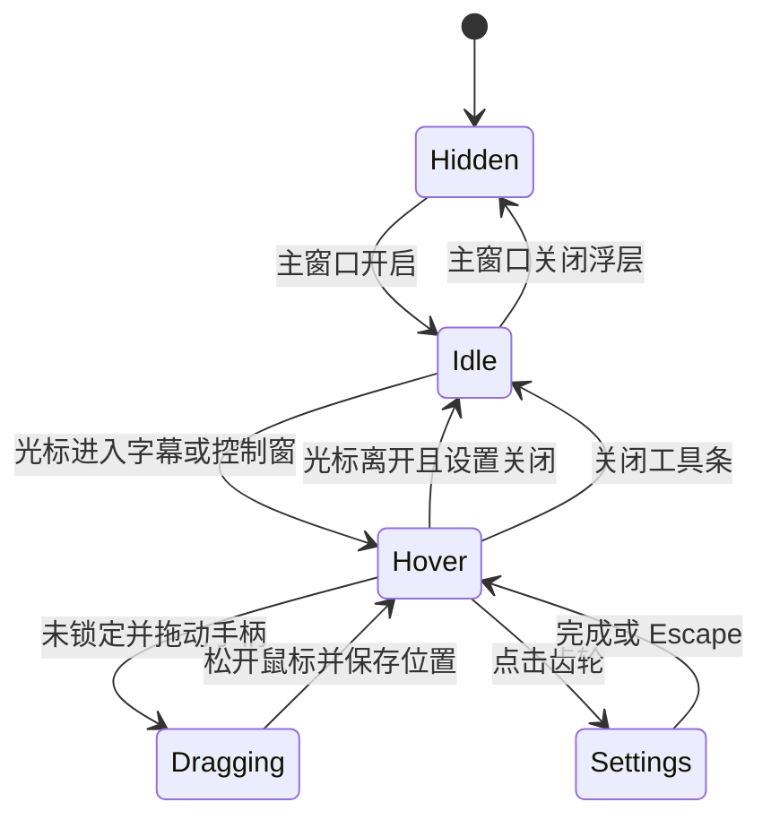

# Windows 悬浮字幕交互

Windows 浮层保留固定的双语字幕排版，不使用歌词滚动、逐字高亮或播放动画。字幕内容继续来自现有 `DesktopSubtitleOverlayFeed`，provisional、final、迟到译文、保留时间和手动纠正仍使用原有状态流。

## 窗口分工

| HWND | 用途 | 鼠标行为 |
|---|---|---|
| `Echo.Windows.NativeSubtitleOverlay.1` | Win2D/Direct2D 绘制白色原文和译文，使用 premultiplied-alpha layered window | `ClickThrough=true` 时持续设置 `WS_EX_TRANSPARENT`，不接收普通命中；关闭穿透后接收字幕区鼠标事件 |
| `Echo Subtitle Controls` | WinUI 小型半透明圆角工具条，提供拖动、锁定、穿透、设置、关闭 | 只覆盖自己的按钮矩形；不改变字幕 HWND 的穿透状态 |
| `Echo Subtitle Settings` | 无标题栏的独立 WinUI 设置窗，拥有可访问的 ToggleSwitch、Slider 和按钮 | 只在设置打开时显示；按浮层显示器的工作区定位并跟随浮层，尺寸受工作区限制 |

字幕 HWND 的透明层和控制 HWND 分离，解决 `WS_EX_TRANSPARENT` 会让整窗鼠标命中穿透的问题。悬停检测由活动浮层期间每 90ms 查询一次光标坐标完成，没有安装低级鼠标 Hook。工具条贴合字幕窗上沿，鼠标从字幕移动到工具条时没有间隔；面板打开期间工具条保持显示。鼠标离开两者后工具条隐藏，不会移动字幕。

## 状态机

`PositionLocked` 与 `ClickThrough` 是独立配置：锁定只禁止移动；点击穿透只决定字幕绘制窗是否带 `WS_EX_TRANSPARENT`。未锁定时，工具条拖动手柄捕获指针并移动字幕窗；箭头键可按 12 DIP 移动，方便键盘操作。穿透仍开启时，只有控制窗按钮接收点击。普通区点击会穿过字幕绘制窗。

设置窗打开时显示原文、显示译文、原文字号、译文字号、整体透明度、最大宽度、定稿保留秒数、文字阴影、锁定位置和点击穿透。变化立即调用现有 `ApplySettings` 绘制预览，并在 350ms 空闲后写入 `settings.json`。恢复默认保留当前显示器和位置；重置位置将浮层放回当前工作区的默认位置。

## 位置、显示器与生命周期

- 位置和宽度继续保存在 `DesktopSubtitleOverlaySettings`：显示器设备名、工作区归一化 X/底边位置与宽度比例。
- 设置窗先尝试放在字幕上方，工作区顶部空间不足时放在字幕下方；横向/纵向尺寸不超过当前显示器工作区。
- 主字幕窗继续无 owner、置顶且不激活；最小化主窗口不会通过 owner 关系隐藏字幕。
- 关闭浮层会停止悬停轮询并隐藏控制窗。应用退出时释放控制窗、字幕 HWND、定时器、feed 事件订阅和绘制资源。
- 设置预览只刷新视图和既有配置，不创建录音设备或 Soniox 会话。

## 恢复操作

1. 在工具条点击锁图标即可锁定或解锁。
2. 点击穿透打开时，工具条和设置窗仍是可点击控制区；点击字幕其余区域会到达下层应用。
3. 若工具条不可见或状态不确定，在 Echo 主窗口悬浮字幕菜单中选择“恢复悬浮字幕控制”。该入口开启浮层、关闭点击穿透并解锁位置。
4. 主窗口还保留浮层开关，可直接隐藏字幕。

## 验收记录与限制

- A92 首轮：隔离 Release x64 构建通过，CoreChecks 193 项通过。该结果仅是编译与源码/业务回归证据，不代表交互验收通过。
- 独立包身份 UI Automation、真实悬停/拖动、设置实时预览、点击穿透下层命中、反复开关和多屏/DPI结果在 `docs/windows/testing.md` 后续 A92 回执中逐项记录。
- 单屏机器无法验证第二显示器实际切换；不能用模拟屏幕坐标代替多显示器证据。DPI 热切换、任务栏移位、Narrator 和长时间 GPU 资源观察也须单独标明。
- 设置窗和工具条是同一浮层交互流程中的独立 HWND，设置窗暂用深色亚克力风格。不同 Windows 主题/系统亚克力策略可能改变材质外观。
- 用户视觉验收仍由用户进行；UI Automation 与截图只证明隔离测试包的可见/可操作状态。
