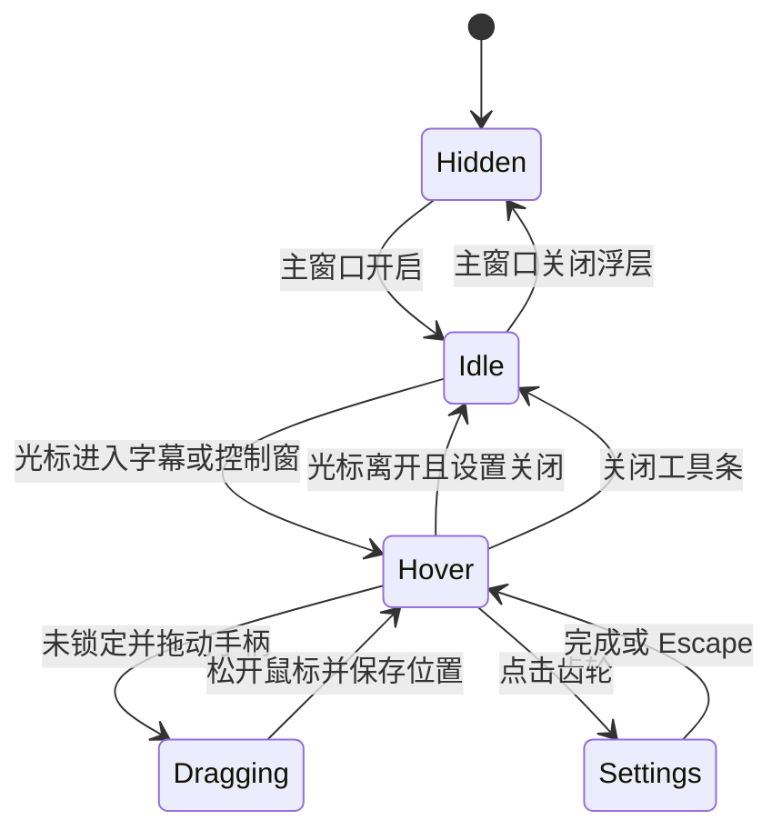

# Windows 悬浮字幕交互

Windows 浮层保留固定的双语字幕排版，不使用歌词滚动、逐字高亮或播放动画。字幕内容继续来自现有 `DesktopSubtitleOverlayFeed`，provisional、final、迟到译文、保留时间和手动纠正仍使用原有状态流。

## 窗口分工

| HWND | 用途 | 鼠标行为 |
|---|---|---|
| `Echo.Windows.NativeSubtitleOverlay.1` | Win2D/Direct2D 绘制白色原文和译文，使用 premultiplied-alpha layered window | `ClickThrough=true` 时持续设置 `WS_EX_TRANSPARENT`，不接收普通命中；关闭穿透后接收字幕区鼠标事件 |
| `Echo Subtitle Controls` | WinUI 小型半透明圆角工具条，提供拖动、锁定、穿透、设置、关闭 | 只覆盖自己的按钮矩形；不改变字幕 HWND 的穿透状态 |
| `Echo Subtitle Settings` | 无标题栏的独立 WinUI 设置窗，拥有可访问的 ToggleSwitch、Slider 和按钮 | 只在设置打开时显示；按浮层显示器的工作区定位并跟随浮层，尺寸受工作区限制 |

字幕 HWND 的透明层和控制 HWND 分离，解决 `WS_EX_TRANSPARENT` 会让整窗鼠标命中穿透的问题。悬停检测由活动浮层期间每 90ms 查询一次光标坐标完成，没有安装低级鼠标 Hook。工具条贴合字幕窗上沿，鼠标从字幕移动到工具条时没有间隔；面板打开期间工具条保持显示。鼠标离开两者后工具条隐藏，不会移动字幕。

工具条为 184×40 DIP，小圆角半透明底，五个 30×30 DIP 图标按钮保持固定宽度；名称、工具提示和 UI Automation 名称表达当前动作/状态。设置窗为 304×416 DIP 紧凑弹出面板：标题和底部操作固定，中央 `*` 行滚动；原文/译文显示、两种字号、透明度和最大宽度直接可见。“更多设置”展开保留时间、阴影、锁定、穿透、重置位置和恢复默认。每次打开回到常用设置视图，Escape、标题栏关闭语义和“完成”都会先写入待保存修改再隐藏面板。

弹出面板以工具条 HWND 为锚点，先比较上方/下方可用高度；都不足时尝试左右空间，再将面板放入较大区域并收缩到工作区。尺寸按锚点窗口 DPI 换算。90ms 轮询仍用于 hover，但只有锚点矩形、工作区或 DPI 变化时才会调整设置窗位置/尺寸；这避免指针停留期间重复移动或调整窗口。纯函数 `OverlayPopoverLayout.Place` 负责像素坐标夹取，可在无 GUI 条件下验证。

## 状态机

`PositionLocked` 与 `ClickThrough` 是独立配置：锁定只禁止移动；点击穿透只决定字幕绘制窗是否带 `WS_EX_TRANSPARENT`。未锁定时，工具条拖动手柄捕获指针并移动字幕窗；箭头键可按 12 DIP 移动，方便键盘操作。穿透仍开启时，只有控制窗按钮接收点击。普通区点击会穿过字幕绘制窗。

设置窗打开时立即预览并持久化：常用项为原文/译文显示、原文字号、译文字号、整体透明度和最大宽度；更多项为定稿保留秒数、文字阴影、锁定位置、点击穿透、默认值和位置重置。变化立即调用现有 `ApplySettings` 绘制预览，并在 350ms 空闲后写入 `settings.json`；关面板时会先 flush 待保存修改。恢复默认保留当前显示器和位置；重置位置将浮层放回当前工作区的默认位置。

## 位置、显示器与生命周期

- 位置和宽度继续保存在 `DesktopSubtitleOverlaySettings`：显示器设备名、工作区归一化 X/底边位置与宽度比例。
- 设置窗锚定工具条，依据上方/下方可用空间择位，并按当前显示器工作区收缩/夹取；其滚动主体有界。几何纯函数检查覆盖屏幕上下边缘、窄/短工作区以及 100%、125%、150%、200% 的物理像素换算。
- 主字幕窗继续无 owner、置顶且不激活；最小化主窗口不会通过 owner 关系隐藏字幕。
- 关闭浮层会停止悬停轮询并隐藏控制窗。应用退出时释放控制窗、字幕 HWND、定时器、feed 事件订阅和绘制资源。
- 设置预览只刷新视图和既有配置，不创建录音设备或 Soniox 会话。

## 恢复操作

1. 在工具条点击锁图标即可锁定或解锁。
2. 点击穿透打开时，工具条和设置窗仍是可点击控制区；点击字幕其余区域会到达下层应用。
3. 若工具条不可见或状态不确定，在 Echo 主窗口悬浮字幕菜单中选择“恢复悬浮字幕控制”。该入口开启浮层、关闭点击穿透并解锁位置。
4. 主窗口还保留浮层开关，可直接隐藏字幕。

## 验收记录与限制

- A92 曾记录一次隔离 GUI 完整流程的控制台通过结果；该次没有保留原始 JSON。之后扩展复跑有 UIA 过期和拖动坐标时序失败，最新诊断 JSON `docs/sources/windows-a92-overlay-controls-2026-10-10/ui-interaction-results.json` 的 6 项全部失败。因此该 GUI 流程没有可重复通过证据，不能作为本次改版的视觉/交互验收。
- A93 紧凑面板修复：CoreChecks 195 项通过，新增工作区边缘、短面板和 100/125/150/200% DPI 纯几何检查；Release x64 构建 0 警告、0 错误。更新后的隔离 GUI smoke 脚本尚未运行。
- A93 没有操控本机鼠标或启动 Echo。只确认 Hyper-V 可见性标志为 true，但 `Get-VM`/`vmrun` 不可用且未发现运行中的 VM 进程；因此本次没有可确认的独立 GUI 桌面，整面板截图、hover/焦点/UIA 边界、多屏热切换和透明合成实测均待独立测试环境验收。A92 透明窗口捕获曾把透明像素合成为黑色，不作为桌面真实透明度证据。
- 单屏机器无法验证第二显示器实际切换；不能用模拟屏幕坐标代替多显示器证据。DPI 热切换、任务栏移位、Narrator 和长时间 GPU 资源观察也须单独标明。
- 设置窗和工具条是同一浮层交互流程中的独立 HWND，设置窗使用紧凑深色亚克力风格。不同 Windows 主题/系统亚克力策略可能改变材质外观。
- 用户视觉验收仍由用户进行；UI Automation 只证明隔离测试包的可见/可操作状态。当前单屏环境不能证明多屏/DPI切换。
